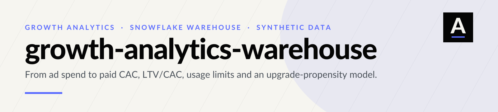
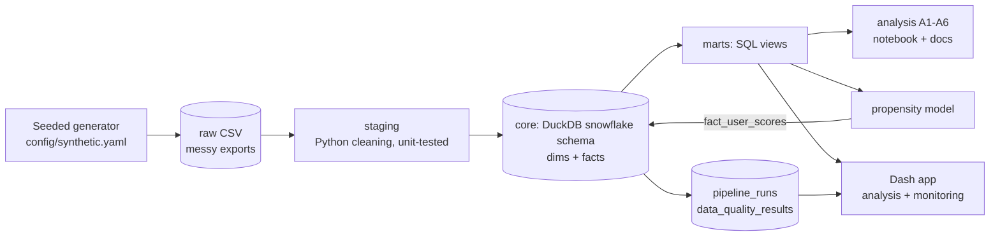
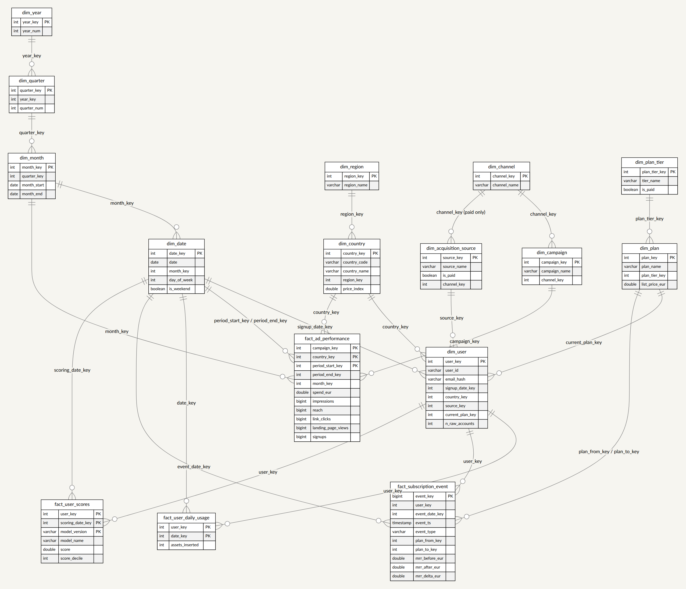
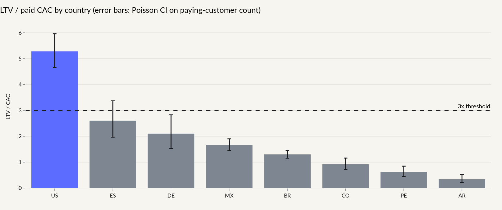
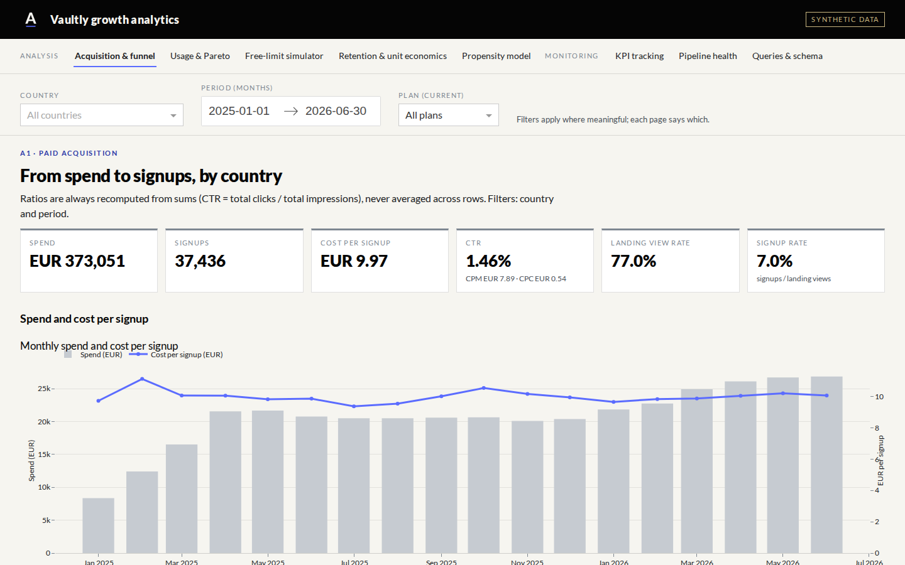
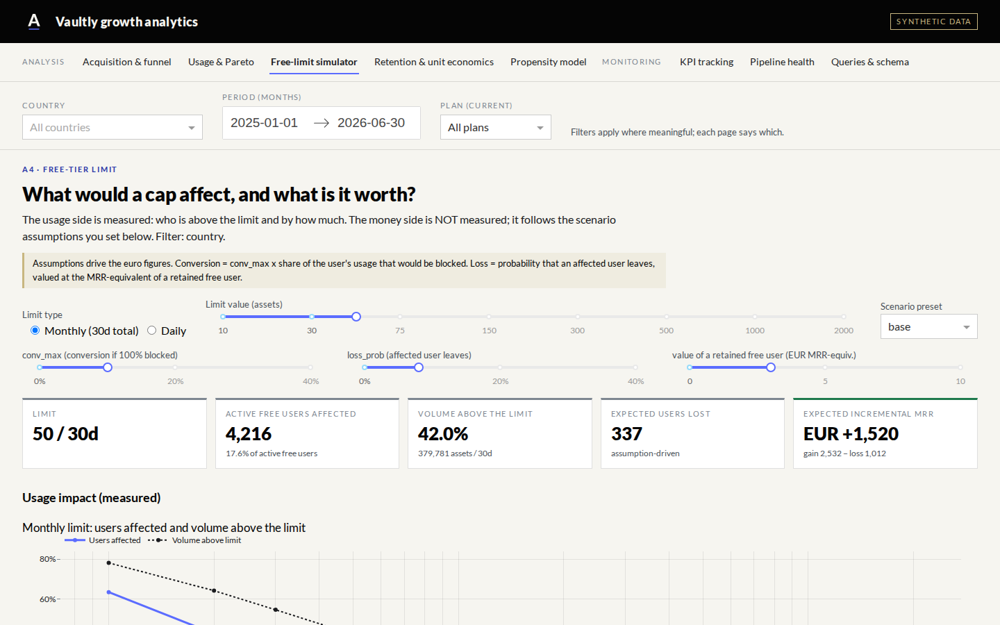
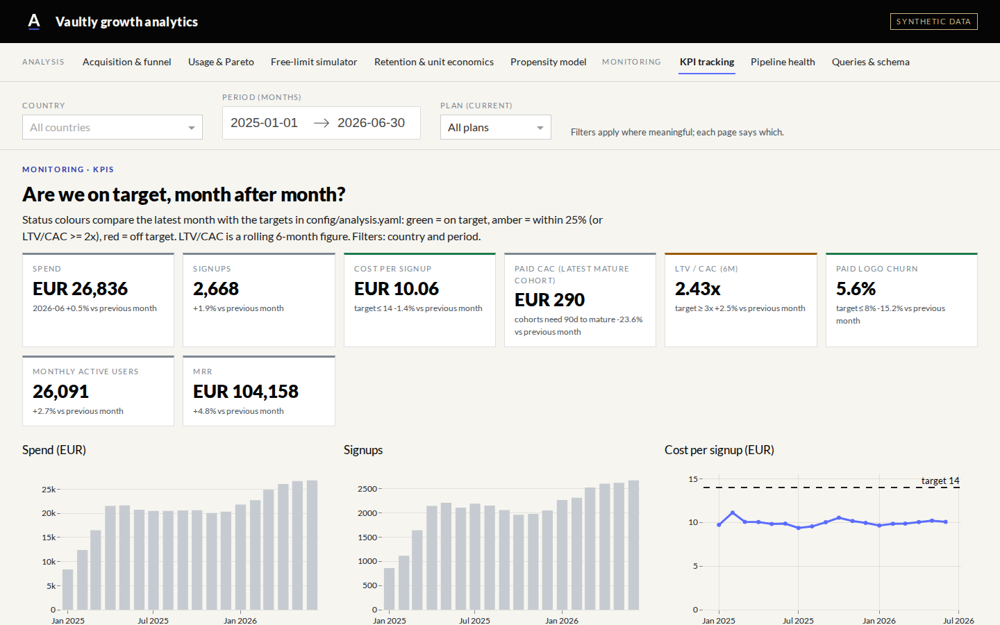
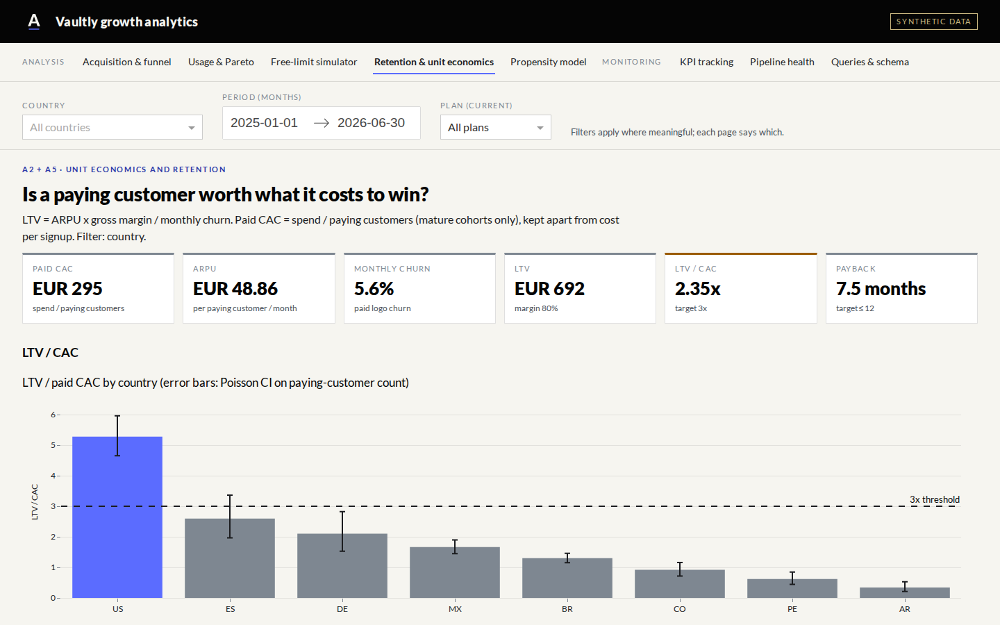

<p align="center">
  <picture>
    <source media="(prefers-color-scheme: dark)" srcset="assets/brand/header-dark.svg">
    
  </picture>
</p>

> **Everything in this repository is SYNTHETIC.** The company ("Vaultly"), its users, ad spend and results are generated by a seeded
> simulator with invented, round parameters. Nothing describes a real business, and no real-world impact is claimed.

An end-to-end growth analytics platform for a fictional freemium B2B SaaS: a synthetic data generator that emulates messy exports, a tested
Python pipeline, a DuckDB **snowflake-schema** warehouse, a documented SQL catalog, a full analysis (acquisition, unit economics, usage
concentration, free-tier limits, retention, upgrade propensity) and a Plotly Dash app that shows both the analysis and ongoing monitoring.

## Business problem

A freemium product pays for paid media in several countries with very different economics, and its free users are heavily skewed: a
small group of power users consumes most of the volume. Leadership wants to know:

1. Where does paid media actually pay back? (cost per signup is not the same as the cost of a paying customer)
2. How concentrated is free usage, and what would a free-tier limit affect and be worth?
3. Who is likely to upgrade next, and how should limited outreach budget be spent?
4. Is the data trustworthy enough to answer 1 to 3, and is it still fresh tomorrow?

## Key results

<!-- RESULTS:START -->
*All figures below come from the synthetic run (`make all`) and describe a fictional company.*

| Question | Result (synthetic) |
|---|---|
| Paid acquisition | EUR 373,051 spend, 37,436 signups, blended cost per signup EUR 9.97 |
| BR vs MX | signup rate p = 0.40; cost per signup gap EUR -0.88 (bootstrap 95% CI -1.88 to +0.07) |
| Paid CAC vs signup cost | blended paid CAC EUR 295 is ~30x the cost per signup; they are different metrics |
| Unit economics | blended LTV/CAC 2.35x, payback 7.5 months; only US at or above 3x (best US 5.3x, worst AR 0.3x) |
| Usage concentration | 29.8% of active users produce 80% of volume (30d); 7.4% produce 50% |
| Free-limit recommendation | monthly limit of 50 assets, affecting 17.6% of active free users; expected incremental MRR EUR -1,517 / +1,520 / +4,726 (low / base / high) - **assumption-driven** |
| Upgrade propensity | hold-out PR-AUC 0.105 vs base rate 0.006; top-decile lift 6.8x; profit-optimal threshold contacts 21.1% of users |

Details: [docs/RESULTS.md](docs/RESULTS.md) and [docs/MODEL_CARD.md](docs/MODEL_CARD.md).
<!-- RESULTS:END -->

## Architecture



| Layer | What happens | Where |
|---|---|---|
| raw | period strings, mixed-case and `+alias` e-mails, decimal commas, numbers as strings, blank rows and columns, duplicates | `src/generate/`, `data/raw/` (git-ignored) |
| staging | split periods, normalise e-mails, coerce numbers, drop empties, dedupe, consolidate user/day | `src/pipeline/transforms.py`, `staging.py` |
| core | snowflake schema with PK/FK/CHECK constraints and surrogate keys | `sql/ddl/`, `sql/staging/` |
| marts | funnel, unit economics, Pareto, limit simulation, retention, model features | `sql/marts/` |
| ops | `pipeline_runs`, `pipeline_run_tables`, `data_quality_results` (68 checks) | `src/pipeline/quality.py` |

## Data (synthetic) and the generator

`python -m src.generate` simulates ~18 months (Jan 2025 to Jun 2026) of a fictional product in 8 countries (BR, MX, CO, PE, US, ES, DE, AR),
each with its own CPM, CTR, conversion, churn and price level. It produces: ad performance per campaign × country × month; users (with
acquisition source); daily asset insertions per user (heavy-tailed, with ~1.5% power users); and subscription events. Paid-source users
equal the ads' signups, so the datasets reconcile. All parameters are round numbers in [`config/synthetic.yaml`](config/synthetic.yaml);
the run is fully determined by the seed. A tiny sample of each raw file is committed in [`data/sample/`](data/sample).

## Schema summary

Snowflake design: `dim_date → dim_month → dim_quarter → dim_year`, `dim_country → dim_region`, `dim_channel → dim_campaign`,
`dim_user → dim_plan → dim_plan_tier`, `dim_acquisition_source`; facts `fact_ad_performance`, `fact_user_daily_usage`,
`fact_subscription_event` (also the plan-change history) and `fact_user_scores`.



Details, grain of each fact, the slowly-changing-attribute design and **why snowflake instead of star (and the trade-offs)** are in
[docs/SCHEMA.md](docs/SCHEMA.md).

## Query catalog

Every query is one file in [`sql/`](sql) with a header (id, business question, tables, grain, output, what it replaces), listed in
[docs/QUERIES.md](docs/QUERIES.md). It includes *reconstructed* extraction queries that rebuild, against the core tables, the datasets a
typical notebook would start from (daily insertions per user, heavy users in 30d/90d, free-user totals, average per active day, the
ad-performance export, monthly churn by country).

## Analysis summary

| | Question | Method highlights |
|---|---|---|
| A1 | Funnel and cost by country and month | ratio-of-sums; two-proportion z-test **and** clustered bootstrap CIs; Holm correction |
| A2 | Does a paying customer pay back? | cost per signup **and** paid CAC kept separate; LTV, LTV/CAC, payback; Poisson CI on CAC; sensitivity grid |
| A3 | How concentrated is usage? | Pareto 50/75/80/90/95, quartiles, IQR fence, active-day bands, 30d vs 90d, Freedman-Diaconis bins |
| A4 | What would a free limit do? | measured usage impact + explicit low/base/high monetisation scenarios with a guardrail; flagged assumption-driven |
| A5 | Who stays? | monthly churn, cohort triangle, Kaplan-Meier survival |
| A6 | Who upgrades next? | next-30-day target, prior-60-day features, time-based purged split, LR vs gradient boosting, PR-AUC, calibration, lift, profit-optimal threshold |

Notebook: [notebooks/analysis.ipynb](notebooks/analysis.ipynb) · numbers: [docs/RESULTS.md](docs/RESULTS.md) · model card: [docs/MODEL_CARD.md](docs/MODEL_CARD.md).

<p align="center"></p>

## Dashboard

Multi-page Plotly Dash app with country, period and plan filters. *Analysis*: acquisition & funnel, usage & Pareto, an interactive free-limit
simulator (limit and scenario sliders), retention & unit economics, propensity model. *Monitoring*: KPI tracking with targets and status colours,
pipeline health (runs, rows per layer, data-quality results, freshness), and the SQL catalog with the schema diagram.
The app builds the synthetic warehouse on first start if the DuckDB file is missing.

| | |
|---|---|
|  |  |
|  |  |

## Limitations and next steps

* Synthetic data encodes the relationships it was told to; real data is noisier, drifts, and has attribution gaps. Results show method, not reality.
* Free-limit **euro figures are scenario assumptions**, not measurements; the recommendation is bounded by a guardrail and should be validated with an A/B test.
* Paid CAC uses mature 90-day cohorts and platform-attributed signups; no incrementality or multi-touch attribution.
* LTV uses a constant-churn formula; real retention curves flatten or decay differently.
* The propensity model predicts *who converts*, not *who is persuaded*; an uplift model or randomised test is the next step. Few positives per snapshot make thresholds noisy.
* Next: scheduled runs with alerting, incremental loads, dbt-style model tests, uplift modelling, hosted demo (see [docs/DEPLOY.md](docs/DEPLOY.md)).

## How to run (from zero)

```bash
git clone https://github.com/arielabade/growth-analytics-warehouse && cd growth-analytics-warehouse
python -m venv .venv && source .venv/bin/activate
pip install -r requirements.txt pytest ruff        # add: nbformat nbclient ipykernel kaleido==0.2.1 playwright for notebook/images
make all            # generate data -> pipeline -> model -> analysis -> docs   (~4 minutes)
make test           # unit + SQL sanity tests
# CI: copy ci/github-actions-ci.yml to .github/workflows/ci.yml (lint, tests, small end-to-end run, leak scan)
make app            # dashboard at http://localhost:8050
make notebook       # re-execute notebooks/analysis.ipynb
GAW_PROFILE=small make all   # ~10x smaller, used by CI
```

Docker: `docker build -t gaw . && docker run -p 7860:7860 gaw`. Repository layout: `config/ src/{generate,pipeline,analysis,model}/ sql/{ddl,staging,marts,analysis}/ app/ notebooks/ docs/ tests/`.

<sub>Visual identity: ABADE (Carbon / Ivory / Cobalt, Lato). Synthetic data throughout.</sub>
