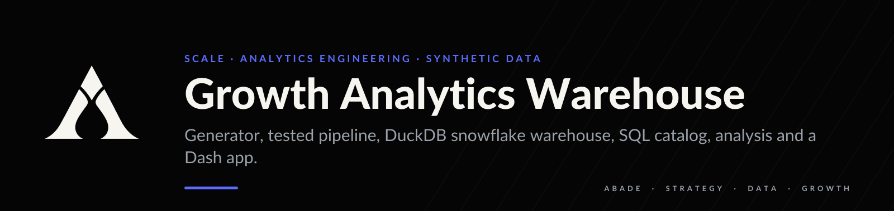
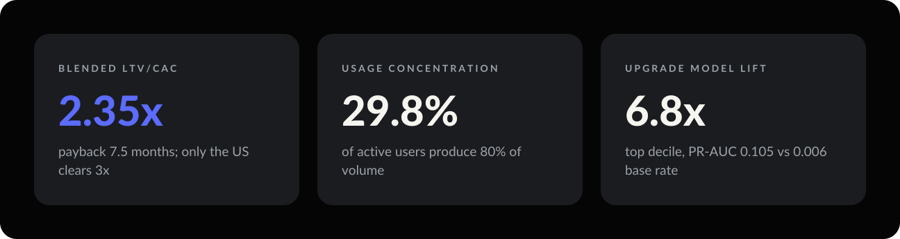
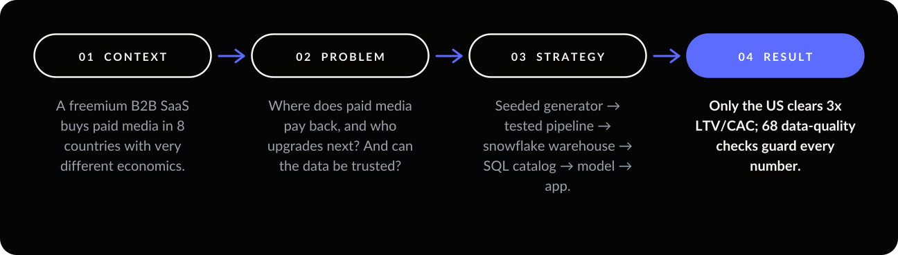
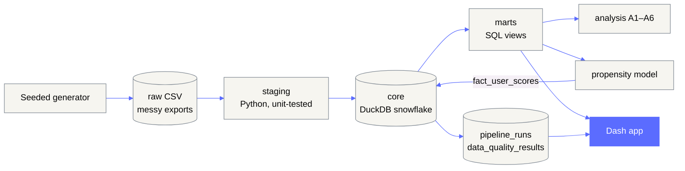
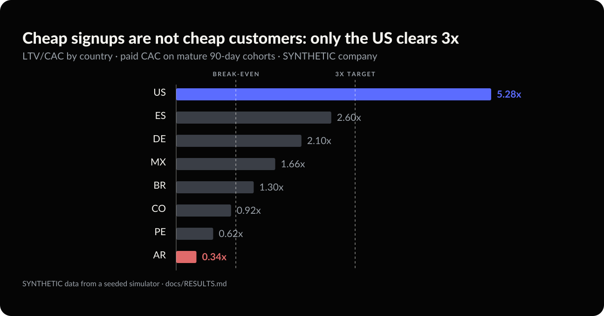
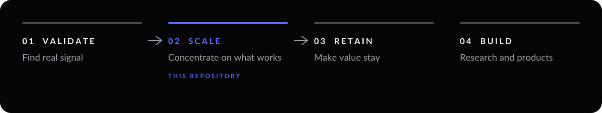

<p align="center"></p>

<p align="center">
  
  
  
  
</p>

> **Everything in this repository is SYNTHETIC.** The company ("Vaultly"), its users, ad spend and
> results come from a seeded simulator with invented, round parameters. No real-world impact is claimed.

**A signup costs EUR 9.97. A paying customer costs EUR 295.** Treating the two as the same metric is how
paid media looks profitable in countries where it is not. Only the US clears 3x LTV/CAC.

<p align="center"></p>

<p align="center"></p>

---

## 01 — Context

A fictional freemium B2B SaaS buys paid media in 8 countries (BR, MX, CO, PE, US, ES, DE, AR), each with
its own CPM, CTR, conversion, churn and price level. Free usage is heavily skewed: about 1.5% power users
consume a large share of volume. The data arrives as messy exports: period strings, `+alias` e-mails,
decimal commas, numbers stored as strings, blank rows and duplicates.

### Data

`python -m src.generate` simulates ~18 months (Jan 2025 – Jun 2026): ad performance per campaign ×
country × month, users with acquisition source, daily asset insertions, and subscription events.
Paid-source users equal the ads' signups, so the datasets reconcile. Every parameter is a round number in
[`config/synthetic.yaml`](config/synthetic.yaml), and the seed fixes the run. A small sample of each raw
file is in [`data/sample/`](data/sample).

---

## 02 — Problem

Leadership needs four answers:

1. **Where does paid media actually pay back?** Cost per signup is not the cost of a paying customer.
2. **How concentrated is free usage**, and what would a free-tier limit affect and be worth?
3. **Who upgrades next**, and how should limited outreach be spent?
4. **Can the data be trusted** to answer 1–3, and is it still fresh tomorrow?

---

## 03 — Strategy



| Layer | What happens | Where |
| --- | --- | --- |
| raw | messy exports, emulated on purpose | `src/generate/`, `data/raw/` (git-ignored) |
| staging | split periods, normalise e-mails, coerce numbers, drop empties, dedupe | `src/pipeline/transforms.py`, `staging.py` |
| core | snowflake schema with PK/FK/CHECK constraints and surrogate keys | `sql/ddl/`, `sql/staging/` |
| marts | funnel, unit economics, Pareto, limit simulation, retention, features | `sql/marts/` |
| ops | `pipeline_runs`, `pipeline_run_tables`, `data_quality_results` (68 checks) | `src/pipeline/quality.py` |

**Snowflake, not star.** `dim_date → dim_month → dim_quarter → dim_year`, `dim_country → dim_region`,
`dim_channel → dim_campaign`, `dim_user → dim_plan → dim_plan_tier`. The trade-offs are documented in
[docs/SCHEMA.md](docs/SCHEMA.md).

<p align="center"></p>

| | Question | Method highlights |
| --- | --- | --- |
| A1 | Funnel and cost by country and month | ratio-of-sums; z-test **and** clustered bootstrap CIs; Holm correction |
| A2 | Does a paying customer pay back? | cost per signup **and** paid CAC kept separate; LTV, payback; Poisson CI on CAC |
| A3 | How concentrated is usage? | Pareto 50/75/80/90/95, quartiles, IQR fence, 30d vs 90d |
| A4 | What would a free limit do? | measured usage impact + low/base/high scenarios with a guardrail |
| A5 | Who stays? | monthly churn, cohort triangle, Kaplan-Meier survival |
| A6 | Who upgrades next? | time-based purged split, LR vs boosting, PR-AUC, calibration, profit-optimal threshold |

Every query is one file in [`sql/`](sql) with a header (id, business question, tables, grain, output),
catalogued in [docs/QUERIES.md](docs/QUERIES.md).

---

## 04 — Result

<p align="center"></p>

<!-- RESULTS:START -->
*All figures below come from the synthetic run (`make all`) and describe a fictional company.*

| Question | Result (synthetic) |
|---|---|
| Paid acquisition | EUR 373,051 spend, 37,436 signups, blended cost per signup EUR 9.97 |
| BR vs MX | signup rate p = 0.40; cost per signup gap EUR -0.88 (bootstrap 95% CI -1.88 to +0.07) |
| Paid CAC vs signup cost | blended paid CAC EUR 295 is ~30x the cost per signup; they are different metrics |
| Unit economics | blended LTV/CAC 2.35x, payback 7.5 months; only US at or above 3x (best US 5.3x, worst AR 0.3x) |
| Usage concentration | 29.8% of active users produce 80% of volume (30d); 7.4% produce 50% |
| Free-limit recommendation | monthly limit of 50 assets, affecting 17.6% of active free users; expected incremental MRR EUR -1,517 / +1,520 / +4,726 (low / base / high) - **assumption-driven** |
| Upgrade propensity | hold-out PR-AUC 0.105 vs base rate 0.006; top-decile lift 6.8x; profit-optimal threshold contacts 21.1% of users |

Details: [docs/RESULTS.md](docs/RESULTS.md) and [docs/MODEL_CARD.md](docs/MODEL_CARD.md).
<!-- RESULTS:END -->

> **Decision.** Judge paid media on paid CAC, not on cost per signup. Concentrate spend where LTV/CAC
> clears 3x (US), and fix price or retention before scaling AR, PE and CO. Validate the free-tier limit
> with an A/B test, because its euro value is a scenario, not a measurement.

**Dashboard.** A multi-page Plotly Dash app covers analysis (acquisition, Pareto, an interactive
free-limit simulator, retention, propensity) and monitoring (KPI targets, pipeline health,
data-quality results, freshness and the SQL catalog).

| | |
|---|---|
|  |  |
|  |  |

---

## 05 — Limits and next move

- Synthetic data encodes the relationships it was told to. Results show method, not reality.
- Free-limit **euro figures are scenario assumptions**, bounded by a guardrail.
- Paid CAC uses mature 90-day cohorts and platform-attributed signups, with no incrementality.
- LTV uses a constant-churn formula; real curves flatten or decay differently.
- The propensity model predicts *who converts*, not *who is persuaded*.
- **Next move:** scheduled runs with alerting, incremental loads, dbt-style tests, uplift modelling and a
  hosted demo ([docs/DEPLOY.md](docs/DEPLOY.md)).

---

## Run it

```bash
git clone https://github.com/arielabade/growth-analytics-warehouse && cd growth-analytics-warehouse
python -m venv .venv && source .venv/bin/activate
pip install -r requirements.txt pytest ruff   # add nbformat nbclient ipykernel kaleido==0.2.1 playwright for notebook/images
make all            # generate → pipeline → model → analysis → docs (~4 minutes)
make test           # unit + SQL sanity tests
make app            # dashboard at http://localhost:8050
make notebook       # re-execute notebooks/analysis.ipynb
GAW_PROFILE=small make all   # ~10x smaller, used by CI
```

Docker: `docker build -t gaw . && docker run -p 7860:7860 gaw`. CI: copy `ci/github-actions-ci.yml` to
`.github/workflows/ci.yml` (lint, tests, small end-to-end run, leak scan).

## Repository map

```
config/      synthetic.yaml (generator), analysis.yaml
src/         generate/  pipeline/  analysis/  model/
sql/         ddl/  staging/  marts/  analysis/   one query per file, with a header
app/         Plotly Dash app (pages, theme, components)
notebooks/   analysis.ipynb
docs/        RESULTS, MODEL_CARD, SCHEMA, QUERIES, DEPLOY, img/
tests/       unit + SQL sanity
scripts/     notebook build, mermaid render, screenshots, leak scan
```

---

<p align="center"></p>

<p align="center">
  <a href="https://github.com/arielabade">Portfolio</a> &nbsp;·&nbsp;
  <a href="https://github.com/arielabade/unit-economics-olist">The same unit economics on real data →</a>
</p>
