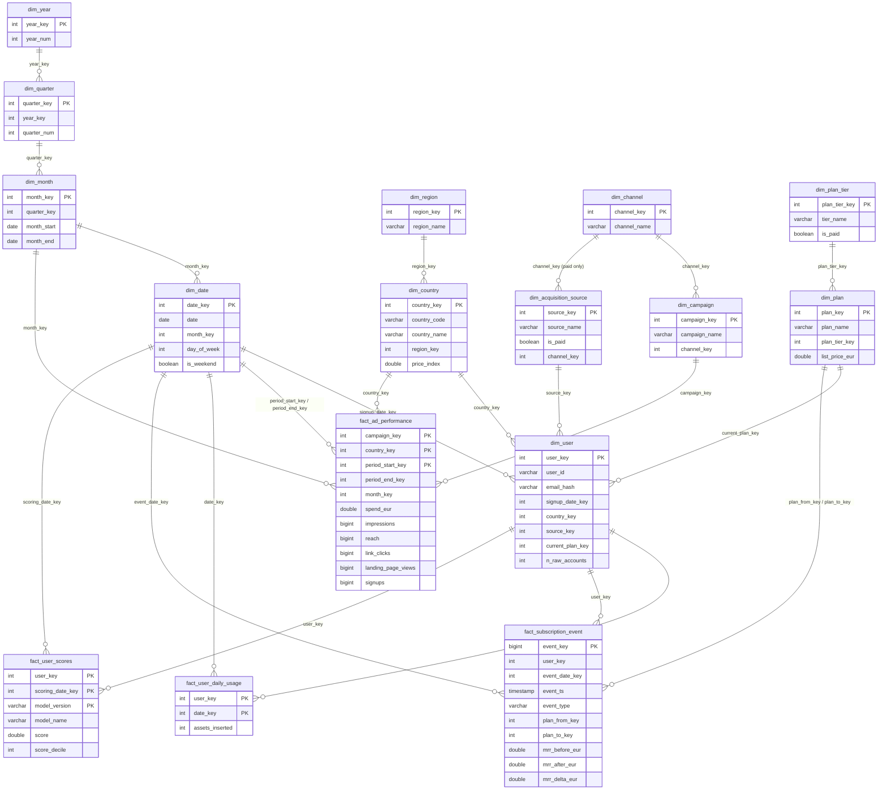

# Warehouse schema (SYNTHETIC data)

DuckDB, snowflake schema: dimensions are normalised into hierarchies (date → month → quarter → year, country → region,
channel → campaign, user → plan → plan tier). DDL lives in [`sql/ddl/`](../sql/ddl); loads in [`sql/staging/`](../sql/staging);
marts (SQL views) in [`sql/marts/`](../sql/marts).

Operational tables (not part of the model): `warehouse_meta` (as-of date, calendar bounds), `pipeline_runs`, `pipeline_run_tables`,
`data_quality_results`, `analysis_results`.

## Grain of every fact table

| Fact | Grain | Primary key | Foreign keys |
|---|---|---|---|
| `fact_ad_performance` | one row per campaign × country × reporting period (calendar month in this dataset) | (campaign_key, country_key, period_start_key) | dim_campaign, dim_country, dim_month, dim_date ×2 |
| `fact_user_daily_usage` | one row per user × calendar day with at least one insertion (sparse: inactive days are absent) | (user_key, date_key) | dim_user, dim_date |
| `fact_subscription_event` | one row per subscription event (signup, upgrade, downgrade, cancel) | event_key | dim_user, dim_date, dim_plan ×2 |
| `fact_user_scores` | one row per user × scoring date × model version | (user_key, scoring_date_key, model_version) | dim_user, dim_date |

Surrogate keys: dimensions use deterministic integer keys assigned in natural-key order (`row_number()`), so a rebuilt warehouse gets the
same keys. Calendar keys are intentionally readable integers (`YYYYMMDD`, `YYYYMM`, `YYYYQ`, `YYYY`). The pseudonymous `email_hash`
replaces the e-mail address; addresses are never stored in the warehouse.

Constraints: every table has a PRIMARY KEY, every relationship a FOREIGN KEY, and facts carry CHECK constraints (non-negative spend and
counts, valid event types, scores in [0, 1]). Indexes: `idx_usage_date` and `idx_event_user` (DuckDB ART indexes help selective
lookups only; columnar scans and zone maps do the heavy lifting, so the project deliberately adds few).

## Slowly changing attributes and plan history

`dim_user.current_plan_key` is a **type-1** attribute: it is overwritten and always reflects the latest plan. History is **not** kept
in the dimension; it lives in `fact_subscription_event`, an append-only event log where every plan change records `plan_from`, `plan_to`
and the MRR before/after. The view [`mart_subscription_history`](../sql/marts/010_mart_subscription_history.sql) turns the log into
type-2-style intervals `[valid_from, valid_to_excl)` with `LEAD()`, so "what plan and MRR did user X have on date D?" is a range join.
This avoids duplicating every user row on each change, keeps one source of truth, and makes MRR movements (new, expansion, contraction,
churn) first-class facts. The trade-off: point-in-time questions need the interval view rather than a plain join. Country and
acquisition source are treated as immutable per user; if they could change, they would need the same event treatment.

## Why snowflake instead of star, and the trade-offs

**Why snowflake here**
* The dimensions have real hierarchies that several marts roll up along (date → month → quarter → year; country → region; channel → campaign; plan → tier). Normalising them stores each attribute once and keeps conformed keys (`dim_month`, `dim_country`) shared across facts: ad spend is monthly, usage is daily, events are timestamped, and all of them meet at `dim_month`.
* `dim_plan_tier` and `dim_acquisition_source → dim_channel` encode business rules (free vs paid, paid channel) once, so a change to the rule is a one-row change instead of a backfill in every table.
* Updates are cheap and consistent: renaming a region or a campaign touches one row.
* Storage is irrelevant at this scale; the design teaches the pattern the same way it would apply at larger scale.

**What it costs**
* More joins per query (a country-by-quarter report joins four tables), which is more SQL to read and slightly slower on engines that do not prune joins well. DuckDB handles these small joins easily; marts exist to hide them.
* Harder for self-service users than a flat star. Mitigation: documented marts that pre-join the hierarchies (`mart_funnel_country`, `mart_unit_economics_country_month`).
* Referential integrity has to be maintained across more tables (enforced with FKs and checked by `data_quality_results`).

**When a star would be better:** a BI tool pointed straight at the model, a very large fact table where join cost dominates, or a
team without SQL depth. One option would be to keep the snowflaked core and publish denormalised star-shaped marts on top, which is what
the mart layer here already does.

## Layers

`raw` (messy CSV exports) → `staging` (clean tables in the `staging` schema; all cleaning is unit-tested Python) → `core` (this
schema, loaded with the SQL in `sql/staging/`) → `marts` (SQL views). Each run is a full refresh, idempotent, and logged to
`pipeline_runs`, `pipeline_run_tables` and `data_quality_results`.
